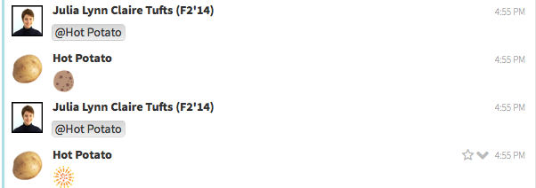

Hot Potato Bot
==============

A simple bot for Hacker School Zulip chat client. Responds to messages in which it is tagged with either a potato or a random surprise emoji, depending on how many times it has been 'passed'.

